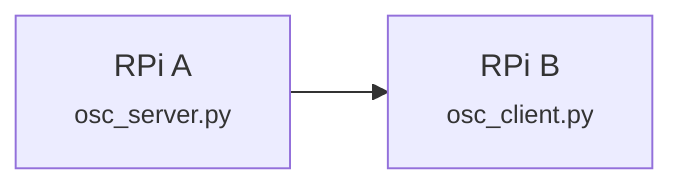

# oscstarterkit
This repository contains resources to get you started on using **Python Open Sound Control (OSC)** messaging protocol between several devices.
1. Raspberry Pi 
2. Desktop / Laptop
3. Audio Visual Equipment

In this starterkit, we will explore the following scenarios to expand our understanding on integrating **OSC**:
1. **Tutorial 1**: Pi to Pi OSC Communication - Click [here](##Tutorial-1)
2. **Tutorial 2**: Push Button (GPIO) to Pi to Pi OSC Communication

## Dependencies
The code base in this repository has been test using **Python 3.9 or higher**.

## Setting Up
If you new to setting up a **Raspberry Pi** single board computer, please visit [**Huats Club rpistarterkit**](https://github.com/huats-club/rpistarterkit) as a quick setup guide. 

## Installing Python OSC
**Python-osc** is a Python library for sending and receiving **Open Sound Control (OSC)** messages. OSC is a protocol for communication among computers, sound synthesizers, and other multimedia devices that is widely used in the field of electronic music and multimedia applications.

Python-osc provides a convenient way to work with OSC in Python by offering functions and classes for creating OSC messages, handling OSC bundles (a collection of OSC messages), and establishing OSC communication between different devices or software applications. It supports both OSC over UDP (User Datagram Protocol) and OSC over TCP (Transmission Control Protocol) for network communication.

### To Install Python-OSC
**On Raspberry Pi**
```
pip3 install python-osc==1.8.1
```

**On Desktop/Laptop**
```
pip install python-osc==1.8.1
```

## Tutorial 1
In this tutorial, we are going to send a simple **OSC** message from one raspberry pi to another. 

Sample code is located under the `tutorial1` folder. 

### System Flowchart



### Instruction
 
1.  Identify the IP address of the Raspberry Pi Server, in this particular case, **RPi A**. Type the following command on the terminal of **RPi A**.
```
ifconfig
```

If you are using **Ethernet Connection**, identify the *IP address* under the `eth0` section.

If you are using **WiFi Connection**, identify the *IP address* under the `wlan0` section. 

2. Edit the server IP address `receiver_ip` (*line 4*) in `osc_server.py file.

Open and edit `osc_server.py` (please make sure you are in the correct directory)
```
nano osc_server.py
```

Enter corresponding *IP Address* retrieved in **Step 1** into `line 4`. Below is an example
```
receiver_ip = "192.168.1.100"
```

Save and exit **nano editor**
```
Crtl + O
Crtl + X
```

3. Edit the desination IP address `PI_A_ADDR` (*line 16*) in `osc_client.py` file.

Open and edit `osc_client.py` 
```
nano osc_client.py
```

Enter corresponding *IP Address* retrieved in **Step 1** into `line 16`. Below is an example
```
PI_A_ADDR = "192.168.1.100"
```

Save and exit **nano editor**
```
Crtl + O
Crtl + X
```

4. Execute `osc_server.py` 
```
python3 osc_server.py
```

5. Excute `osc_client.py` 
```
python3 osc_client.py
```