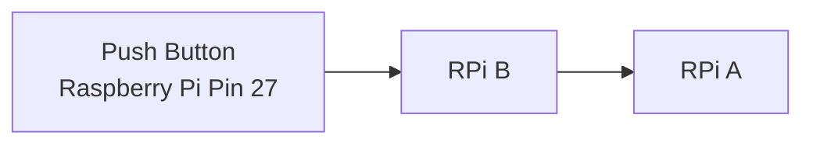

# Tutorial 2
In this tutorial, we are going to use a push button as a triggering device to transmit an **OSC message** from one **Raspberry Pi** to another.

## System Flowchat


## About RPi.GPIO
**RPI.GPIO** is a python library for controlling the General Purpose Input / Output (GPIO) pins on a Raspberry Pi. We are using the **RPi.GPIO** library to configure the **Raspberry Pi** internal **Pull Up/Down** resistor.

### Installation
```
sudo apt update
sudo apt install python3-rpi.gpio
```
or 
```
pip3 install RPi.GPIO==0.7.0
```

### GPIO default states when pins are set to input mode on Raspberry Pi
```
GPIO 0 - 8 : HIGH (3.3V)
GPIO 9 - 27 : LOW (0V)
```

### Checking GPIO states on Raspberry Pi
1. You can run `gpio_states.py` located in `./tutorial2` directory 
```
python3 gpio_states.py
```

or 

2. 
```
raspi-gpio get <Pin Number>
```

## Operation

### button_press.py
This python file allows the first message to be sent upon the first press of the button and a second message to be sent upon the second press. This script assumes you will not be holding the button between presses.

1. Open and edit `button_press.py` (please make sure you are in the correct directory)
```
nano button_press.py
```
2. Enter the corrosponding **IP Address of RPi A** into `line 6`. Below is an example
```
PI_A_ADDR = "192.168.1.100"
```
3. If you would like to use `GPIO Pin` other than `Pin 27`, you can edit `line 17`. Below is an example ysubg `Pin 26`
```
button_pin = 26
```
4. Save and exit **nano editor**
```
Crtl + O 
Crtl + X
```
5. Run `button_press.py`
```
python3 button_press.py
```


### button_hold.py
This python file sends the first message when the button is first pressed, and a second when the button is released.

1. Open and edit `button_hold.py` (please make sure you are in the correct directory)
```
nano button_hold.py
```
2. Enter the corrosponding **IP Address of RPi A** into `line 6`. Below is an example
```
PI_A_ADDR = "192.168.1.100"
```
3. If you would like to use `GPIO Pin` other than `Pin 27`, you can edit `line 17`. Below is an example using `Pin 26`
```
button_pin = 26
```
4. Save and exit **nano editor**
```
Crtl + O 
Crtl + X
```
5. Run `button_press.py`
```
python3 button_hold.py
```