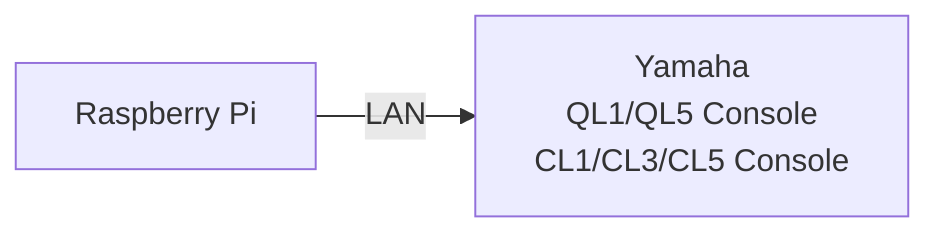

# Tutorial 4
In this tutorial, we are going to use **Raspberry Pi** to control **Yamaha QL/CL series** Audio Mixing Console.
Please note that the resources in this tutorial works specifically for the following Yamaha consoles:
1. Yamaha QL1
2. Yamaha QL5
3. Yamaha CL1 
4. Yamaha CL3
5. Yamaha CL5

Credits to **Yamaha Professional Audio** - [Link](https://uk.yamaha.com/en/news_events/2019/0610_50_python.html)

## System Flowchat


## Installation / Operation

1. Create a directory folder for the required python files. In this particular case, we are going to name the folder *yamaha*
```
mkdir yamaha
```

2. Please copy the following files into the folder director `~/yamaha`
```
command.py
recall.py
yamaha.py
```

3. Go to the directory `~/yamaha`
```
cd ~/yamaha
```

4. Edit the *IP Address* of the *Yamaha Console* in the respective python files

- Line 11 of `command.py`
```
host ="192.168.0.128"
```

- line 11 of `recall.py`
```
host ="192.168.0.128"
```

5. Run the python file `yamaha.py`. If the run is executed successfully, it will shift the *Yamaha Console's* fader 1, 2 and 3 to +10dB as a demonstration
```
python3 yamaha.py
```