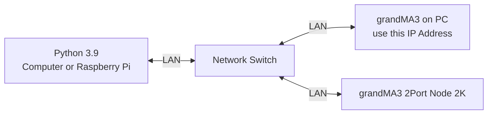

# Tutorial 5
In this tutorial, we are attempting to control the **grandMA3** using **python osc** messaging protocol.

The resources in this tutorial are tested with the following hardware
1. Computer running **grandMA3 onPC (Version)**
2. **grandMA3 onPC 2Port Node 2K**
3. **python 3.9 or higher**

## System Flowchart

## Configuration guide for grandMA3 onPC

Please refer to the **setup guide** for instructions specific to configuring **OSC control** on the **grandMA3 onPC software**.

[setupguide_link](./GrandMA3_OSC_setupguide.pdf)


## OSC Support on grandMA3
For more instruction in **OSC for grandMA3**, please refer to this [link](https://help2.malighting.com/Page/grandMA3/remote_inputs_osc/en/1.8).

## Installation / Operation
In this example, we will be using a **Raspberry Pi** to control **grandMA3 on PC**. 

1. Create a file directory (in this example we will call the folder `grandma`)
```
mkdir grandma
```

2. Copy the respective python file into the folder `~/grandma`
```
grandma.py
```

3. Edit the **IP Address and Port Number** (`line 18 and 19`) of the **computer** running **grandMA3 on PC** in `grandma.py`
```
LAPTOP_IP = "192.168.0.100"		# send to laptop w grandMA3
PORT = 8000                     # laptop w grandMA3 port number
```

4. Execute `grandma.py`. If the file is executed successfully, Sequence 1 will be triggered in the software
```
python3 grandma.py
```