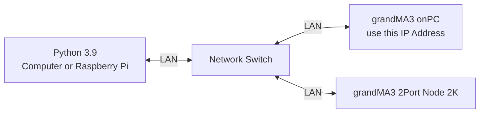

# Tutorial 5
In this tutorial, we are attempting to control the **grandMA3** using the **python-osc** messaging protocol.

The resources in this tutorial are tested with the following hardware and software:
1. Computer running **grandMA3 onPC**
2. **grandMA3 onPC 2Port Node 2K**
3. **Python 3.9 or higher**

---

## OSC Support on grandMA3
For more information on **OSC for grandMA3**, please refer to the [official documentation](https://help2.malighting.com/Page/grandMA3/remote_inputs_osc/en/1.8).

---

## Configuration Guide for grandMA3 onPC

Before running any Python script, you must configure the **grandMA3 onPC software** to receive OSC commands.

Please refer to the setup guide (file: `GrandMA3_OSC_setupguide.pdf`) for step-by-step instructions, including:
- Configuring the **2Port Node** hardware network settings
- Inviting the node in **grandMA3 onPC Network**
- Configuring **sACN / DMX Protocols**
- Patching fixtures
- Creating sequences and cues
- Enabling **OSC In & Out** settings (Step 6 in the setup guide)

> **Key OSC settings to verify in grandMA3 (Menu > In & Out > OSC):**
> - Destination IP: set to the IP address of the computer sending OSC
> - Port: `8000`
> - Prefix: `gma3`
> - Receive: `Yes`
> - Receive Command: `Yes`
> - Echo Input: `Yes`

---

## Part A: Controlling grandMA3 over LAN (Raspberry Pi)

In this example, a **Raspberry Pi** sends OSC commands to **grandMA3 onPC** running on a separate computer, connected via a network switch.

### System Flowchart


```mermaid
graph LR
A[Python 3.9<br>Computer or Raspberry Pi] <--LAN--> B[Network Switch]
B <--LAN--> C[grandMA3 onPC<br>use this IP Address]
B <--LAN--> D[grandMA3 2Port Node 2K]
```

### Files needed
| File | Purpose |
|------|---------|
| `grandma.py` | Python script that sends a sequence trigger command via OSC |

### Installation and Operation

1. Create a folder for the project files

```
mkdir grandma
```

2. Copy the Python script into the folder `~/grandma`

```
grandma.py
```

3. Open `grandma.py` and edit the **IP Address and Port Number** at lines 18 and 19 to match the computer running **grandMA3 onPC**

```python
LAPTOP_IP = "192.168.0.100"    # IP address of the computer running grandMA3
PORT = 8000                    # OSC input port set in grandMA3
```

4. Install the required Python library

```
pip install python-osc
```

5. Run the script. If successful, **Sequence 1** will be triggered in grandMA3

```
python3 grandma.py
```

### What the script does

`grandma.py` sends a single OSC message to the address `/gma3/cmd` with the command `"Go Sequence 1"`. This is the simplest form of OSC control, useful for triggering pre-programmed cues from an external device.

---

## Part B: Controlling grandMA3 on the Same PC (Windows + VS Code)

*This section is based on the work contributed by Syakil Toriman (from Diploma in Infocomm Media & Engineering, Nanyang Polytechnic), 2025.*

In this example, **Visual Studio Code** on the same Windows PC as **grandMA3 onPC** sends OSC commands using the loopback address. This approach does not require a network switch or a Raspberry Pi, and extends control to individual fixture attributes such as **Pan** and **Tilt**.

Original repository: [syak-OSC](https://github.com/syakiltrm/syak-OSC)

### System Flowchart


```mermaid
graph LR
A[Visual Studio Code] --Python-osc / Loopback 127.0.0.1--> B[grandMA3 OnPC]
```

### Files needed
| File | Purpose |
|------|---------|
| `GMA3_OSC.py` | Python script that controls fixture Pan and Tilt attributes via OSC |
| `OSC_Project_2025S1.show` | grandMA3 show file with fixtures pre-patched and OSC configured |
| `LoadShow.md` | Instructions for loading the show file into grandMA3 onPC (Windows) |

### Setting Up grandMA3

1. Load the show file `OSC_Project_2025S1.show` into grandMA3 onPC.
   Refer to `LoadShow.md` for instructions on how to place the `.show` file in the correct Windows directory and load it from within grandMA3.

2. Once the show file is loaded, configure the **In & Out** settings. Navigate to **Menu > In & Out > OSC** and verify the following:
   - Port: `8000`
   - Prefix: `/gma3/cmd`
   - Receive Command: `Yes`

   Refer to the images below for guidance:

   


### Setting Up Visual Studio Code

1. Copy `GMA3_OSC.py` into your project folder and open it in **VS Code**

2. Confirm that Python is installed. Run the following in the VS Code Terminal:

```
py --version
```

If a version number appears (e.g. `Python 3.x.x`), Python is installed. If not, install Python before continuing.

3. Install the required Python library:

```
py -m pip install python-osc
```

### Running the Script

Run the script from the VS Code Terminal:

```
py GMA3_OSC.py
```

If successful, you will see feedback in the **grandMA3 System Monitor** and the fixture attributes will update accordingly.


### What the script does

`GMA3_OSC.py` sends OSC commands to control **Pan** and **Tilt** attributes on specific fixtures. It uses a value converter function to translate human-readable degree values (e.g. `45` degrees) into the 0–65535 integer range that grandMA3 expects via its `Absolute Decimal16` command.

The key function is `set_attribute()`:

```python
set_attribute("Fixture 1", "pan", 45, -315, 315)
#              fixture      attribute  value  min   max
```

The last two values (`-315` and `315`) are the physical rotation limits of the patched fixture. These vary by fixture model, so check the fixture's attribute min/max in grandMA3 before editing them.

> **Note on IP address:** `GMA3_OSC.py` uses the loopback address `127.0.0.1` because grandMA3 and VS Code are running on the same machine. If you want to send from a separate device (as in Part A), change `GMA3_IP` to the IP address of the grandMA3 computer.

---

## Comparison: Part A vs Part B

| | Part A (Raspberry Pi / LAN) | Part B (VS Code / Same PC) |
|---|---|---|
| Hardware needed | Raspberry Pi or separate computer, network switch | Windows PC only |
| Connection | LAN (separate IP addresses) | Loopback (127.0.0.1) |
| What gets controlled | Sequences (cue triggering) | Fixture attributes (Pan, Tilt) |
| Script | `grandma.py` | `GMA3_OSC.py` |
| OS | Linux / macOS / Windows | Windows |
| Run command | `python3 grandma.py` | `py GMA3_OSC.py` |

---

## Video Demonstration

[](https://www.youtube.com/watch?v=jwd8Y4fDfvI)

*Click the image above to watch the Part B demonstration video.*