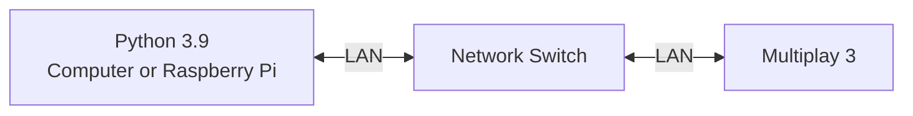
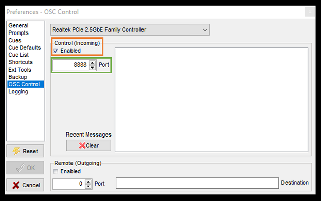

# Tutorial 6
In this tutorial, we are attempting to control the **Multiplay** using **python osc** messaging protocol.

The resources in this tutorial are tested with the following hardware
1. Computer running **Multiplay 3 (tested on 3.0.198.0 or 3.0.199.0-video)**
2. **Python 3.9 or higher**

## System Flowchart


## Mutliplay 3

**Multiplay** is a Windows based program designed to play cues for theatre or coporate application. Below is the list of some supported features that may be useful for automating your next project using Python. 

1. Single / list (mono or stereo) audio file playback
2. Timed pauses
3. Control cues to act upon other cues
4. Serial or network strings to trigger external devices 
5. OSC commands 
6. MIDI commands 

Below are some links that may be useful for learning. 

1. For more information on **Multiplay 3**, vist [link](https://da-share.com/forum/index.php)
2. For download and install **Multiplay 3**, visit [link](https://da-share.com/forum/index.php?topic=74.0)
3. For OSC controls in **Multiplay 3**, visit [link](https://da-share.com/forum/index.php?topic=249.0)
4. **Multiplay 3** Help File [file](http://da-share.com/help/multiplay3/index.html)

## Multiplay Configuration

1. Enable **OSC Control** in **Multiplay 3**, navigate to the following
```
file -> Perferences  -> OSC Control
```

2. Clik on **Enable Control Incoming** (Orange Box) and define a **Port Number** (Green Box)



*Multiplay 3 OSC Setting*


## Python Installation / Operation

1. Create a directory folder for the required python files. In this particular case, we are going to name the folder *multiplay*

```
mkdir multiplay
```

2. Please copy the following files into the folder directory `~/multiplay`
```
multiplaymessage.py
```

3. Go to the directory `~/multiplay`
```
cd multiplay
```

4. Edit the IP Address (`line 21`) and the Port Number (`line 22`) in `multiplaymessage.py`
```
IP = "127.0.0.1" #Local Host Address
PORT = 8888
```

5. Edit the **OSC Command** (`line 23`) in `multiplay.py`
```
message = "/cue/1/go" # Trigger Cue 1
```

6. Save and run the python file `multiplay.py`
```
python3 multiplay.py
```