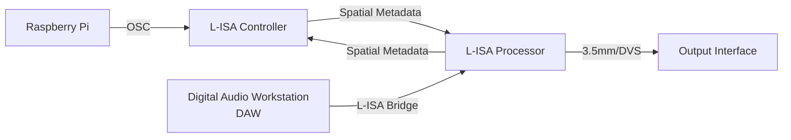
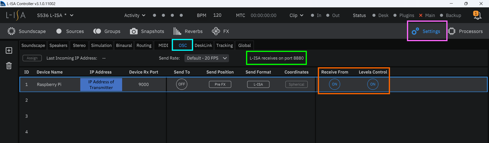
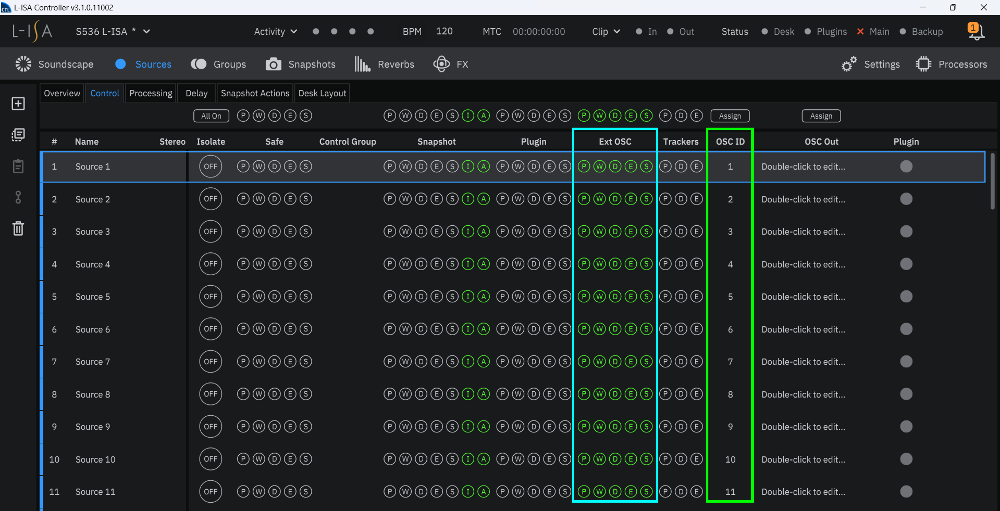

# Tutorial 7
In this tutorial, we are demonstrating on **Raspberry Pi** to control the **L-Acoustic L-ISA Controller** software using **python osc** messaging protocol.


## System Flowchart


## Configuration (L-ISA)

1. Navigate to `Setting` (pink), `OSC` (cyan).
2. Change the IP Address of Incoming OSC control device. Note that L-ISA allows multiple OSC control device
3. Ensure the following parameters are enabled `Receive From` (to allow OSC packet to receive by L-ISA) and `Level Control` (allow OSC to control level parameters in L-ISA Controller) (orange).
4. Note L-ISA receiving OSC port number is fixed at `8880`.



*Sample of L-ISA OSC Setting page*

5. Navigate to `Sources`
6. Enable OSC control for the following parameters (cyan)
    * Pan 
    * Width
    * Distance
    * Elevation 
    * Aux Send
7. Configure OSC control ID for each source (green)



*Sample of L-ISA Sources page*

## Configuration (Raspberry Pi)

1. Create a directory folder for the required python files. In this particular case, we are going to name the folder *lisa*.

```
mkdir lisa
```

2. Please copy the following files into the folder directory `~/lisa`

```
lisa_mv.py
lisa_snap.py
```

3. Go to the directory `lisa`

```
cd ~/lisa
```

4. Edit the *IP Address* of the *Laptop (running L-ISA Controller)* in the respective python files

- Line 19 of `lisa_mv.py`
```
PI_A_ADDR = "10.10.10.10"
```

- Line 19 of `lisa_snap.py`
```
PI_A_ADDR = "10.10.10.10"
```

5. Run the python files `lisa_mv.py` or `lisa_snap.py` (please ensure you have configured 2 or more snapshots  in L-ISA). If the script is executed successfully, *pan* value of source 1 in L-ISA (`lisa_mv.py`) or fire *next snapshot* in L-ISA (`lisa_snap.py`).

```
python3 lisa_mv.py
python3 lisa_snap.py
```

## L-ISA OSC API

In this tutorial, we are using the *OSC API* in **L-ISA Controller**. The API will contain controllable function for ezternal device to interact with L-Acoustic L-ISA software. To access **API Documentation**

1. Press `F1`
2. Search `OSC API`