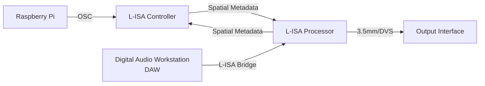

# Tutorial 7
In this tutorial, we are demonstrating on **Raspberry Pi** to control the **L-Acoustic L-ISA Controller** software using **python osc** messaging protocol.

## System Flowchart

## Configuration (L-ISA)

1. Navigate to `Setting` (pink), `OSC` (cyan).
2. Change the IP Address of Incoming OSC control device. Note that L-ISA allows multiple OSC control device
3. Ensure the following parameters are enabled `Receive From` (to allow OSC packet to receive by L-ISA) and `Level Control` (allow OSC to control level parameters in L-ISA Controller) (orange).
4. Note L-ISA receiving OSC port number is fixed at `8880`.

*Sample of L-ISA OSC Setting page*