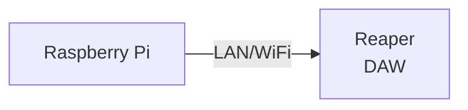
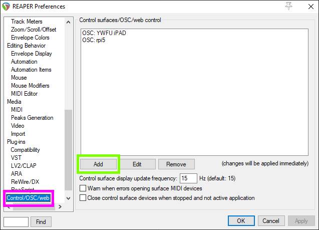
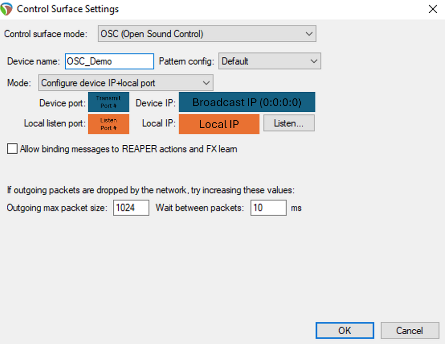
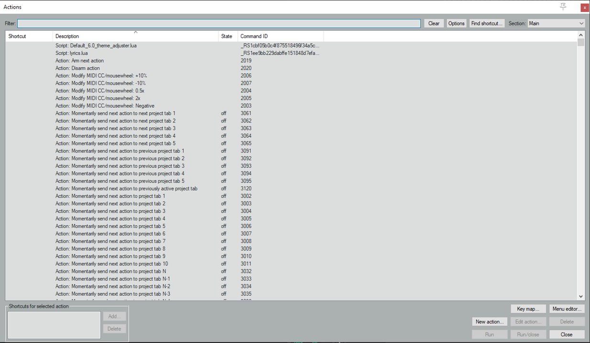

# Tutorial 8
In this tutorial, we are going to use **Raspberry Pi** to control **Reaper** Digital Audio Workstation (DAW).

## System Flowchart


## Configuration (Reaper)

1. Go to **Reaper Preference** using the shortcut `Ctrl+P`
2. Navigate to **Control/OSC/Web** (green box)
3. Click on `Add` to configure a new OSC device 



*Reaper Preference Windows*

4. Configure new **OSC Device** as shown in the picture below



## Configuration (Raspberry Pi)

1. Create a directory folder for the required python files. In this particular case, we are going to name the folder *reaper*.

```
mkdir reaper
```

2. Please copy the following files into the folder directory `~/reaper`

```
play_stop.py
marker_1.py
```

3. Go to the directory `reaper`

```
cd ~/reaper
```

4. Edit the *IP Address* of the *Laptop (running Reaper)* in the respective python files

- Line 19 of `play_stop.py`
```
PI_A_ADDR = "10.10.10.10"
```

- Line 19 of `marker_1.py`
```
PI_A_ADDR = "10.10.10.10"
```

5. Run the python files `play_stop.py` or `marker_1.py` (please ensure you have configured marker 1 in Reaper). If the script is executed successfully, it will play/stop the playback on reaper (`play_stop.py`) or playback will shift to marker 1 (`marker_1.py`).

```
python3 play_stop.py
python3 marker_1.py
```

## Identifying OSC Commands in Reaper

In this tutorial, we are using the *Action List* in **Reaper**. In Reaper, the *Action List* is a comprehensive catalogue of commands and functions that you can execute within the softwaer. It covers basic features such as playback controls to complex scripting operations. 

To view *Action List* navigate to `Actions -> Show action list...`

Look out for `Command ID` (right click to unhide)



*Reaper Action List*